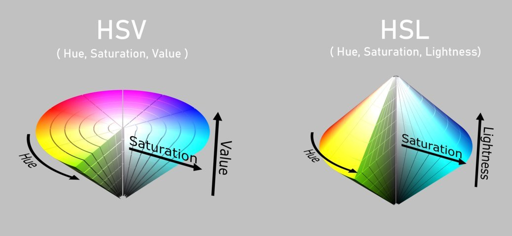
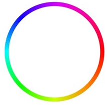
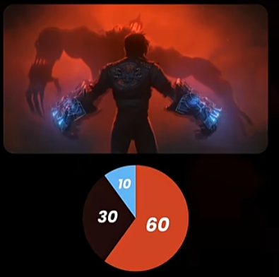
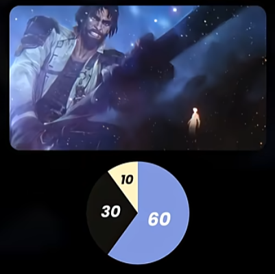
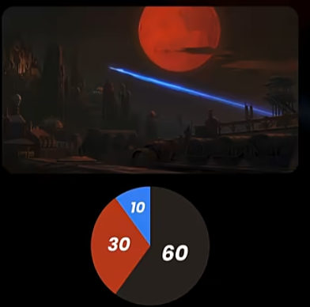
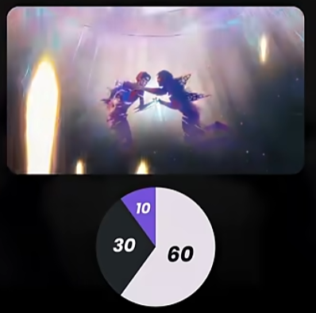
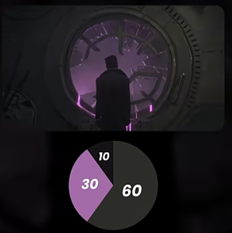
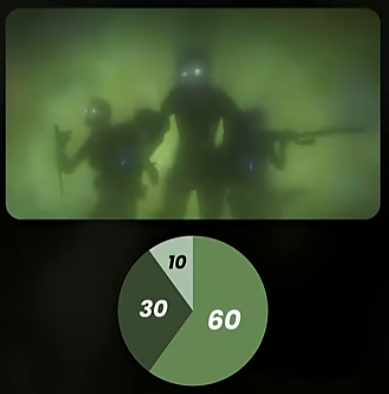

# URO
## Metody a nástroje pro realizaci grafických uživatelských rozhraní (kognitivní schopnosti člověka, mentální modely, základní pravidla designu, barevné prostory, volba barev a prezentace textu)

### Kognitivní schopnosti člověka
- Kognitivní schopnosti = vnímání, myšlení, paměť, pozornost, učení, řešení problémů.
- GUI musí být intuitivní a snižovat kognitivní zátěž.
- Důležité:
    - Jednoduchá navigace,
    - Přehledné uspořádání,
    - Konzistence,
    - Jasná zpětná vazba.
- Krátkodobá paměť:
    - Člověk si pamatuje cca 7 ± 2 položky,
    - GUI nesmí uživatele přetěžovat.
- Dlouhodobá paměť:
    - Využívání známých ikon a metafor (koš, lupa, nůžky).
### Gestalt theory
- Teorie, která popisuje lidské vnímaní celkků složených z částí
    - Člověk intuitivně rozděluje na objekty a pozadí
    - Hlavní principy:
        - Blízkost – blízké prvky vnímáme jako skupinu.
        - Podobnost – podobné prvky patří k sobě.
        - Uzavřenost – mozek doplňuje chybějící části.
        - Figura a pozadí – důležité prvky musí vystupovat z pozadí.
        - Kontinuita – oko sleduje plynulé linie.
    - V GUI:
        - Používat jednoduché tvary,
        - Nepřeplácané pozadí,
        - Jasné skupiny prvků.
    
### Mentální modely
- Uživatel si vytváří „mapu systému“.
- GUI musí odpovídat očekávání uživatele.
- Pokud je aplikace nelogická → frustrace a odchod uživatele.
- Používat známé principy:
    - Košík vpravo nahoře,
    - Standardní ikony,
    - Běžné ovládací prvky.

### Základní pravidla designu
- **Shneidermanových 8 zlatých pravidel**
    - Konzistence
    - Informativní zpětná vazba
    - Prevence chyb
    - Undo/Redo
    - Kontrola uživatele nad systémem
    - Podpora zkušených uživatelů
    - Organizace do uzavřených celků
    - Nepřetěžovat krátkodobou paměť

- **Konzistence**
    - Stejné barvy,
    - Stejné fonty,
    - Stejné chování prvků.
- **Zpětná vazba**
    - Systém musí reagovat na akce uživatele:
    - Potvrzení akce,
    - Chybové hlášky,
    - Načítání.

- **Prevence chyb**
    - Nedovolit neplatné akce,
    - Validace formulářů,
    - Jasné chybové zprávy,
    - Nabídnout pomoc při opravě chyby.

- **Undo/Redo**

- **Kontrola uživatele nad systémem**
    - Změna barev
    - Fonty
    - Velikost
    - Osobní customization

- **Podpora zkušených uživatelů**
    - Klávesové zkratky
    - Makra
    - Zkratky pro urychlení práce

- **Organizace do uzavřených celků**
    - Větší akce o více kroků rozdělit do více částí ('Uložit jako' otevře okno -> Výběr umístění otevře další...)
    - Po vykonání každé akce dát uživateli zpětnou vazbu

- **Nepřetěžovat krátkodobou paměť**
    - Nesmí být chaos
    - Přehledná struktura

### Barevné prostory
- Fyziologické x Psychologické
    - Fyziologické - Možnosti lidského zraku
    - Psychologické - Pocitově

- **RGB**
    - RED + GREEN + BLUE
    - Zobrazovací zařízení
        - Obrazovky
        - Projektory
    
- **CMYK**
    - CYAN + MAGENTA + YELLOW + BLACK
    - Pro tisk

- **HSV**
    - HUE + SATURATION + VALUE
    - odstín + systost + jas
    - Jednoduší hledání odstínu
    - Color picker, photoshop...

- **HSL**
    - HUE + SATURATION + LIGHT
    - odstín + systost + světlost
    - Jako HSV, akorát světlost není ovlivněná sytostí
        - Světlost je:
            - 0%: Černá
            - 50%: Jasná barva (záleží na Hue a Sat)
            - 100%: Bílá

### Schémata barev
**Způsoby, jak kombinovat barvy, aby spolu vizuálně fungovaly**

- **Monochromatické**
    - Jedna barva
    - Světlější a tmavší varianty
    - Minimalistický desing, dahsboardy...

- **Analogické (Blízké)**
    - Vedle sebe na Hue circle
    - Modrá, modrozelená, zelená
    - Harmonické, příjmené pro oči
    - Ilustrace, interiéry, webdesing

- **Komplementární**
    - Naproti sobě v Hue circle
    - Modrá a Oranžová, Červená a Zelená
    - Vysoký kontrast, energivké, výrazné
    - Reklama, plakáty

- **Split-komplementární**
    - Jedna hlavní a dvě analogické na druhé straně Hue circle
    - Působí moderně
    - UI, branding, ilustrace

- **Triadické**
    - Tři barvy rovnoměrně rozmístěné na Hue circle
    - Oranžová, Zelená, Fialová
    - Jedna by měla být dominantní, zbytek podpůrná
    - Herní grafika, dětské produkty, zábavní průmysl

- **60:30:10 Rule**
    - Rozložení tří hlavních barev
    - 60%: Dominantní barva - Pozadí, velké plochy, atmosféra
        - Zpravidla neutrální barva
    - 30%: Sekundární barva - Dodává hloubku, kontrastuje
    - 10%: Akcentní barva - Nejvýraznější, vytváří focus, přitahuje pozornost

  
  
  
  
  
  

### Volba barev
- Při výběru zohledňujeme:
- Cíl a náladu,
- Cílovou skupinu,
- Kontrast a čitelnost,
- Kulturní význam barev,
- Harmonii barev.
- *Myslet na barvoslepé uživatele*

- Lidský zrak
    - Nejcitlivější na žluto-zelenou
    - Nejméně na modro-fialovou
    - Zhruba 9% populace má vadu vnímání barevného spektra

### Prezentace textu
- Zásady
    - Krátké odstavce,
    - Přehledná struktura,
    - Nepoužívat moc fontů,
    - Nepoužívat dlouhé texty CAPS LOCKEM,
    - Omezit italic a bold,
    - Vhodný kontrast.
- Fonty
    - Bezpatkové (Verdana, Arial)
        - Vhodné pro obrazovky,
        - Lepší čitelnost na monitoru.
    - Patkové (Times New Roman)
        - Vhodné pro tisk,
        - Patka vede oko po řádku.