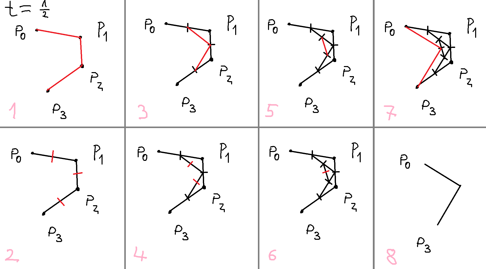

# ZPG

## Standardní zobrazovací řetězec (realizace jednotlivých kroků řetězce, modelovací a zobrazovací transformace, Phongův osvětlovací model, řešení viditelnosti, identifikace těles, stručná charakteristika standardu OpenGL a jazyka GLSL)

### Zobrazovací řetězec

- **Vertex shader** - Vrací lokaci
    - Vezme data a pro každý vertex zavolá funkci
    - Na GPU, paralelně
    - Určuje, kde budou body
    - Probíhají v něm transformace
- **Clipping**
    - Ořízne všechno mimo zorné pole
    - Vytvoří nové vertexy na hraně view
- **Rasterizace**
 - Převede tělsa na fragmenty
    - Fragment - *Kandidát* na pixel. Každá pozice pixelu může mít více fragmentů, při vykreslování se pak vykreslí ten nejbližší (většinou)
- Pošle fragmenty do fragment shaderu
- **Fragment Shader** - Vrací barvu fragmentu
    - Interpoluje hloubku, barvu, texturu, normály...
- **Texture unit**
    - Fragment shader požádá o vzorek textury
    - TU převede UV souřadnice na skutečné souřadnice v textuře
        - UV mapping
            - Nearest
                - Který pixel je nejblíž
            - Linear, Bilinear, Trilinear... (1,2,3 vekotry)
                - Vezme nejbližší a ve směru x vektorů interpoluje s ostatními
    - V případě šáhnutí mimo texturu dopočítá
        - Repeat
        - Mirror repeat
        - Clamp to edge
    - Použije derivaci sousedních vrcholů
    - Výsledek se vrátí fragment shaderu
- **Framebuffer** - Doublebuffer - Do jednoho se zapisuje, zatímco druhý je zobrazený, pak se přehodí. Zamezuje se tak postupnému vykreslování obrazovky. (Někde se používá triplebuffer -> same thing tbh)
    - Color buffer - Každý buffer má 8 bitů (0-255).
        - Skládá se ze čtyř bufferů pro rgba (rgb ze tří)
        - Každý buffer určuje hodnotu jednotlivé barvy, popřípadě alfa složky
    - Depth buffer / Z-buffer
        - Každý fragment uchovává hloubku jak daleko je od kamery
        - Prochází fragmenty, uchovává ten nejbližší, najde-li bližší, zahodí ten přechozí a uloží si nový nejbližší
        - 0 je near plane
        - 1 je far plane
        - Z-fighting - pixely které jsou *v sobě* problikávají
    - Stencil buffer
        - Udržuje o fragmentech číslo (stencil value), které pak může porovnávat s nějakým pravidlem
        - Na projektu u každého fragemntu udržuje id drawable objectu

### Modelovací a zobrazovací transformace

### Phong

- **I** - Intezita světla
- **r** - Materiálová složka
- **a** - Ambientní
    - Konstatní neměná složka, simuluje odraz paprsků, i když na plochu nesvítí žádné světlo, není žádoucí mít čistě černou plochu
    - Přidává se jedna na konec bez ohledu na počet světel
- **d** - Difuzní
    - Barevná část.
    - Alfa - Úhel mezi normálou povrchu a směrem ke světlu
- **s** - Spekulární
    - Odražená část (Odlesk)
    - Fí - Úhel mezi odraženým vektorem světla a směrem pohledu kamery (oka)
    - h - Shininess. Určuje jak moc se bude odlesk *rozlévat*
        - Větší číslo -> Strmnější pád funkce cosinus -> Menší plocha odlesku
- **HM - Blinn**
    - Fí - Úhel mezi half vecotrem (poloviční mezi vektorem světla a vektorem ke kameře/oku) a normálovým vektorem

## Geometrické modelování (afinní a projektivní prostory, popis těles a možnosti jejich reprezentace, základní křivky používané v počítačové grafice, jejich vyjádření, vlastnosti a použití, Fergusonova kubika, Bézierova křivka)
### Afiní a projektivní prostory
- Afinní prostor (big nono)
    - ((P1 + T1) S1) + T2
        - Pro každý bod
        - Náročné
        - Nemůžeš si to vypočítat předem
- Projektivní prostor (big yes yes)
    - Přidáš homogení složku (další rozměr)
    - Lze všechno násobit
    

### Základní křivky
- Křivka je určená pomocí:
    - Kontrolních bodů
    - Případě také tečných vektorů
- Typy:
    - Interpolované
    - Aproximační
    - Spline
    - Beziérovy
    - Fergusonovy kubiky

### Beziér
- $P(t) = \sum_{i=0}^{n} P_iB_i^n(t)$
    - $B_{i,n}(t) = \binom{n}{i}t^i(1-t)^{n-i}$
    - Suma všech bodů, násobených všemi bázovými funkcemi
    - Bernsteinovy polynomy (Bázové funkce)
        - Součet všech bázových funkcí pro libovolné t: 1
        - Každá bázová funkce je nezáporná
        - Funkce jsou symetrické
        - Rekurizvní definice
        - Určují, jak moc budou jednotlivé body ovlivňovat křivku
    - Tvořená minimálně 2 body (V praxi se používá řetězení 4 bodových)
        - Linérní 2 body, kvadratický 3 body, kubický 4 body...
    - Leží v konvexním obalu bodů
    - Je hladká a plynulá

 **A+B vzorec** | **Bezier** |
| --- | --- |
| (a + b) = a + b | (1-t)P0 + tP1
| (a + b)2 = a2 + 2ab + b2 | (t-1)2P0 + 2t(1-t)P1 + t2P2
| (a + b)3 = a3 + 3a2b + 3ab2 + b3 | (1-t)3P0 + 3(1-t)2tP1 + 3(1-t)t2P2 + t3P3
- **t** - Pozice na křivce
- **P0,P1...** - Kontrolní body
- **a** ≈ (1-t)
- **b** ≈ t
- **\+** každý člen * kontrolní bod Px

### Fergusonova křivka
- Kubická parametrická křivka:
    - Dva krajní body
    - Dva tečné vektory

- $P(t)=F_0(t)V_0+F_1(t)V_1+F_2(t)v_0+F_3(t)v_1$
    - $V_0, V_1$ — krajní body křivky
    - $v_0, v_1$ — tečné vektory (tangenty)
    - $t \in [0,1]$ — parametr určující polohu bodu na křivce

- Bázové funkce
    - $F_0(t)=2t^3-3t^2+1$
    - $F_1(t)=-2t^3+3t^2$
    - $F_2(t)=t^3-2t^2+t$
    - $F_3(t)=t^3-t^2$
### de Casteljau algoritmus
- Algoritmus pro výpočet Bezierovy křivky. Umožňuje také dělení křivky.
- Jsou Body P0, ..., Pn
- Výpočet nových bodů pomocí interpolace. (Počet nových bodů = počet původních - 1)
- Spojit nové body křivkami.
- Opakovat interpolaci + křivky, dokud nezůstane jeden bod.
- Výsledný bod je bod na křivce pro dané t.

