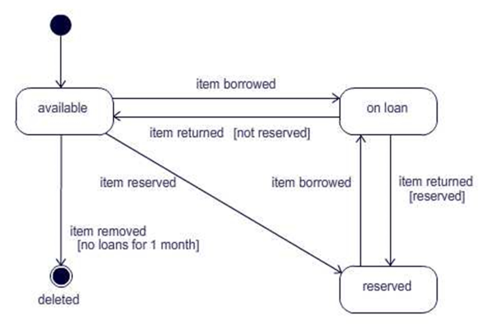
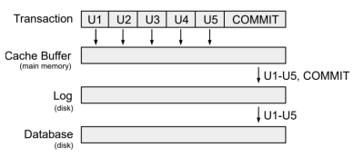
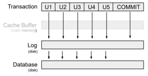
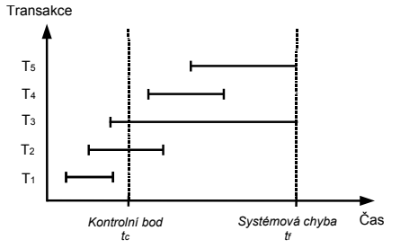
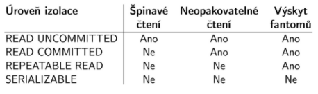

## Databáze
- Databáze - uspořádaná množina dat ve formě záznamů a vztahů
- SŘBD (Systém řízení báze dat) - pro přístup k a údržbě databáze (Oracle, MS Acces, MySQL)
- Databázový systém - Databáze (Data) + SŘBD (Systém)

#### Integritní omezení
- Entitní - žádné dva záznamy nesmí být stejné
    - Slabá entita - FK součástí PK, nemá smyslu bez druhé entity
    - Silná entita - Může existovat nezávisle na jiných entitách
- Doménové - Každý atribut musí mít právě 1 datový typ
- Referenční - Nelze vyplnit cizí klíč bez primárního klíče entity nadřazené
- Uživatelské - Ověřovací pravidla (Věk nesmí být záporný atd.)
#### Modely
- Konceptuální - nezávislý na konkrétní technologii
    - Entity, vztahy, atributy
        - Entita - objekt reálného světa (záznam v tabulce)
        - Atribut - vlastnost entity (slouec v tabulce)
        - Entitní typ - množina entit (tabulka)
        - Klíč - jeden, nebo více atributů, jednoznačně identifikující entitu
        - Vztahy
            - Kardinalita
            - Povinost
- Datový - závislý na technologii, ale ne na konkrétním jazyce
    - Přibývá FK, rozepisuje se M:N, dataové typy
- Fyzický - reprezentuje fyzické uložení dat
---
#### Formy
- 0NF - Alespoń jeden atribut má více hodnot
- 1NF - Každý atribut obsahuje atomické hodnoty
- 2NF - Každý neklíčový atribut je plně závislý na celém PK
- 3NF - Všechny neklíčové atributy musí být vzájemně nezávislé
- Boyceho-Coddova NF - Atributy primárního klíče jsou vzájemně nezávislé
#### Funkční závislosti
- Vztah mezi atributy v db
- X -> Y (Y je funkčne závislé na X)
    - Pokud je více záznamů, které obsahují sterjné X, musí mít stejné Y
     - Triviální - Y je podmnožina X
    - Netriviální - Y není podmnožina X
    - Totálně netriviální - Y průnik X je prázná množina
- Uzávěr X - množina atributů, závislá na množině atributů X
- Armstrongovy axiomy
    - Pravidla k odvozování funkčních závislostí
        - Reflexivita
            - Pokud je množina podmnožnou jiné, je závislá
            - množina {jméno} je podmnožinou {jméno, příjmení}, takže {jméno, příjmení} -> jméno
        - Tranzitivita - zřetěžení závilostí
            - X -> Y a Y -> Z => X -> Z
        - Pseudotranzitivita
            - X -> Y a WY -> Z => WX -> Z
        - Sjednocení
            - X -> Y a X -> Z => X -> YZ
        - Dekompozice
            - X -> YZ => X -> Y a X -> Z
        - Augmentace (Rozšíření)
            - X -> Y => XZ -> YZ
        - Zúžení
            - X -> Y a Z je podmnožinou Y => X -> Z
- Výpočet uzávěru
    - Zadání: Uzávěr pro A. A->D, D->C, AC->B, B->E
    - Pracovní množina X{A} - Pokud je levá strana závislosti podmnožinou pracovní množiny, přidat pravou stranu závislosti do pracovní množiny
    - A->D: A je v X, takže přidat D do X => X{A,D}
    - D->C: => X{A,C,D}
    - AC->B: => X{A,B,C,D}
    - B->E: => X{A,B,C,D,E}
    - Výsledek je {A,B,C,D,E}
#### ORMD
Objektově relační datový model. Využívají ho například PostgreSQL, Oracle Database
- Rozšiřuje RM o vlastnosti objektů (komplexní datové typy, zapouzdření, dědičnost, metody, transakce)
    - UDT (user data type) - možnost vytvářet vlastní datové typy
    ```
    CREATE TYPE adresa AS (
        ulice TEXT,
        mesto TEXT
    );
    ```
    - Vnořené struktury
    ```
    CREATE TABLE zakaznik (
        id INT,
        adresa adresa
    );
    ```
    - Dědičnost
    ```
    CREATE TABLE zamestnanec (
        plat INT
    ) INHERITS (osoba);
    ```
- \+ Lepší mapování, méně joinů, lepší práce se složitými daty
- \- Složitý návrh, nižší výkon, horší přenositelnost
## SQL my beloved
- SQL (Strucutred Query Language), relační jazyk založen na predikátovém kalkulu
    - DDL (Data definition language) - Definuje strukturu dat
        - Create, Drop, Alter, Truncate, Rename
        - Omezení - Not Null, Unique, Primary key, Foreign key, Index, Check, Auto_Incement, Default
    - DML (Data manipulation language) - Manipuluje s daty
        - Insert, Update, Delete, Lock, Call
    - DQL (Data query language) - Vrací data z db
        - Select, From, Where, Group By, Having, Distinct, Order By,  Limit (MySql, MariaDB)...
            - Oracle Fetch next 5 rows only, JetSQL Select top 5
    - DCL (Data control language) - Práva a permise
        - Grant, Revoke
    - TCL (Transaction control language) - Transakce
        - Begin Transaction, Commit, Rollback, Savepoint
---
- TRUNCATE je DDL (smaže tabulku a vytvoří novou, nespustí ON DELETE trigger, autocommit...)
- DELETE FROM je DML (projde řádek po řádku a smaže záznamy)
#### DQL
- Select - povinný
- From - nepovný(MySql, PostgreSQL, MariaDB) | povinný(Oracle "From DUAL") (JetSQL docs říká poviný, není potřeba)
- Zbytek nepovinný (Vyjímkou je Having, který požaduje Group by)
- **Joins** (Left join == left outer join), outer je navíc, zbytečné, nepodstatné...
    - Left join - Všechno zleva + to co je zprava
    - Right join - Všechno zprava + to co je zleva
    - Inner join - To co mají společné
    - Full join - Všechno
    - Cross join - Kartézský součin (Pro každý záznam spojí s každým z druhé)
- Aliasy jsou finální - ``SELECT * FROM table as t...``
    - ``...WHERE t.atribut`` - projde
    - ``...WHERE table.atribut`` - fail (table už v rámci tohoto SELECtu neexistuje, je to pouze t)
- Selekce (Restrikce) - které řádky chceme (Where)
- Projekce - které sloupce chceme (SELECT sloupec1, sloupec2...)
#### Agregační funkce
- Můžou být použité v select a having, order by
- Vrací jednu hodnotu z více hodnot ve sloupci
    - MIN - čísla, měny, data, znaky
    - MAX - čísla, měny, data, znaky
    - SUM - pouze číselné hodnoty
    - COUNT - všechny hodnoty
    - AVG - pouze číselné hodnoty
#### Množinové operace
- IN - Vrací hodnoty, funguje jako více OR
    - Lepší pro malé seznamy
- EXISTS - Vrací řádky
    - Rychlejší než IN pro větší počty hodnot, pomalejší pro menší množství hodnot
- ALL
- ANY/SOME


## Proceduální rozšíření (PL/SQL, T/SQL...)

- \+ Přidává proceduální logiku, tím umožńuje dělat některé operace na serveru a snížit potřebnou komunikaci s klientem. Umožňuje nezávislot na platformě klienta
- \- Neexistuje přesná specifikace

#### Procedury
- **Anonymní procedury** - Nejsou pojmenované, nemohou být volané v jiné proceduře. Nejsou předkompilované
```
BEGIN
 //...
EXCEPTION
    when other then
    //...
END;
```
- **Pojmenované procedury** - Obsahují hlavičku => jméno a parametry. Může být volána v jiné proceduře, triggeru, nebo příkazem EXECUTE. Předkompilované a uložené v DB (na rozdíl od funkce nevrací hodnotu)
```
CREATE OR REPLACE PROCEDURE Nazev (atribut1 student.login%TYPE) as
BEGIN
//...
EXCEPTION
//...
END;
```
- **Funkce** - Jako pojmenované procedury, ale vrací hodnotu
```
CREATE OR REPLACE FUNCTION Nazev (atribut1 student.login%TYPE) return VARCHAR2 as
BEGIN
//...
EXCEPTION
//...
END;
```
#### Triggery
Spouští se automaticky na základě DML operace (Insert, update, delete). Specifikuje se na jakou akci reaguje, zda se má spustit před, po, nebo místo akce. Referncuje staré hodnoty jako :OLD a nové :NEW (:OLD.login | :NEW.login)
```
CREATE OR REPLACE TRIGGER Nazev
BEFORE DELETE ON tabulka1 // AFTER INSERT, INSTEAD OF UPDATE....
FOR EACH ROW //Row-level trigger. Není povinné, hodnoty :OLD, :NEW fungují jenom s tímhle.
BEGIN
//...
END
```
#### Kurzory
Ukazatel na řádek
- Implicitní - Databáze ho vytváří automaticky pro vnitřní funkčnost(napr. při SELECT INTO, INSERT, UPDATE...)
    - Pracuje s jedním příkazem
    - Atributy: SQL%ROWCOUNT, SQL%FOUND, SQL%NOTFOUND
- Explicitní - Definuje uživatel
    - Umožňuje použití OPEN, FETCH, CLOSE
    - Umožňuje pracovat s více příkazy
    ---
- Práce s kurzory:

    - ``CURSOR Nazev IS Select * from...``
    - ``OPEN Nazev``
    - ``FETCH Nazev INTO Nazvepromenne``
    - ``CLOSE Nazev``

- Sugar syntax
    - ```
        FOR Nazev in (Select * from...) LOOP
        //...
        END LOOP
        CLOSE Nazev
        ```
    - Ve FOR cyklu, není potřeba otevírat, v každém průchodu cyklu kurzor ukazuje na jeden řádek

#### Statické a Dynamické SQL
- Statické SQL
    - V době kompilace jsou známy všechny objekty
    - Oracle kontroluje syntaxi před spuštěním (V případě PL/SQL)
    - Lepší výkon
- Dynamické SQL
    - Když nejsou v době kompilace známy všechny objekty
    - Používáme-li název sloupce/taqbulky z parametru
    - EXECUTE IMMEDIATE
        ```
        v_sql := 'DELETE FROM employees WHERE employee_id = 100';
        EXECUTE IMMEDIATE v_sql;
        ```
    - Umožńuje použití DDL (Statické ne)
## Analýza IS
**Analýza informačního systému slouží k návrhu dat a funkcí systému.**
#### Analýza návrhu
- Vize - Zadání
- Role - Role k přístupu kdb, orpávnění
- Vstupy - Jaké data budou vstupem
- Výstupy - Jaké data budou výstupem
- Funkce - Funkcionalita systému

#### Konceptuální model
**Konceptuální model popisuje entity a vztahy pomocí ER diagramu.**
- Vysokoúrovňový model nezávislý na konkrétní db
- Řeší entity, atributy, vztahy mezi entitami
- Kardinalita, povinnost
#### Datový model
**Datový model převádí návrh do tabulek, klíčů a databázových struktur.**
- Logický
    - Tabulky, PK, FK
    - Řeší normalizaci, redundanci, integirtní omezení
- Fyzický
    - Konkrétní implementace v DBMS
    - Řeši datové typy, indexy, partitioning, constraints
        - Partitioning - Rozdělení dat na části.  DB umí pracovat jenom s některými částmi, takže zrychluje query.
            - Dělení zpravidla podle:
                - Rozsahu:
                    - Datum => 2025, 2026...
                    - ID => 1-1M, 1M-2M...
                - List parititoning:
                    - Podle konkrétních hodnot (Language (CZ, SK, PL...))
                - HASH partitioning
                - KEY partitioning
        - Menší indexy usnadňují práci, ale špatně navržené partitiony může výkon zhoršit
            - Join, unique constraints, foreing keys

#### Stavová analýza
**Stavová analýza řeší životní cyklus objektů a změny stavů.**
- Definuje business logiku, kontroluje povolené operace
- Popisuje změny objektů v čase
    - Objednávka může mít vztahy
        - Vytvořená, zaplacená, expedovaná, doručená, zrušená...
- Stavový diagram
    - Ukazuje stavy, přechody, události, podmínky změn
    

#### Funkční analýza
**Funkční analýza popisuje procesy systému a datové toky, často pomocí DFD a minispecifikací.**
- Co systém dělá, jake procesy probíhají, jak data proudí systémem
- = Popis funkcí, procedur, triggerů, složitějších selectů...
- Analyzuje funkce systému a aktéry, výstupem jsou minispecifikace
    - Minispecifikace - Detailní popis jednotlivých funkcí/procesů
        - Používá přirozený jazyk (Minispecifikace nesmí být závislá na konrétním prostředí)
        - Specifikovaná v bodech, každý bod => jeden příkaz
        - Vstup (zákazník), výstup (nová objednávka), pravidla (zákazník musí existovat, zboží musí být na skladu)
#### Návrh formuláře (Doporučuju MS Access💀)
**Návrh formulářů řeší způsob komunikace uživatele se systémem a vazbu na databázové operace CRUD.**
- Řeší UI
    - Jak budou data zadaná, zobrazována, editována
    - Cílem je přehlednost, jdnoduchost, validace vstupů
- Formulář by měl načítat pouze data potřebná pro daný formulář
- Principy
    - Prvořadost uživatele
        - Zachovávat zvyklosti vzhledu a uspořádání
    - Jednotnost
        - Jednotný styl ovládání a vzhledu
    - Vlídnost
        - Uživatel je snowflake, nevypisovat "CHYBA debile", ale "Zadej celé číslo."
    - Minimalizovat čas pro získaní informací
        - Co nejméeně kroků k získání cíle
    - Úplnost a správnost
    - Maximální spolehlivost
    - Umožnit uživateli změnit volbu
    - Optimalizovat množství výstupních informací
        - Třeba pro komentáře zobrazit 10 a tlačítko "načíst další", místo 30k komentářů

## Transakce
- Atomická operace - Provede se najednou, nejde udělat jenom část, nastane-li při jejím vykonávání chyba, jsou všechny změny vráceny zpět.
- BEGIN TRANSACTION - Začátek transakce
- COMMIT - Pro potvrzení všech změn
- ROLLBACK - Pro vrácení předchozího stavu
- Nesmí se zanořovat. Ani by to z definice nedávalo smysl
- Oracle má autocommit na DDL, nedává se do transakcí
    - PostgreSQL, SQL Server, SQLite povoluje DDL v transakci, MySQL ne
- Vlastnosti transakce
    - Obsahuje sekvenci příkazů
    - Převádí databázi z jednoho korektního stavu na jiný korektní stav
    - Databáze však nemusí být korektní v celém průběhu transakce
    - Musí splňovat ACID
        - Atomicity
            - Transakce musí být atomická, dále nedělitelná. Všechy příkazy puď projdou, nebo žádny neprojde
        - Correctness
            - Transakce převádí korektní stav databáze do jiného korektního stavu
databáze, mezi začátkem a koncem transakce nemusí být databáze v korektním stavu.
        - Isolation
            - Transakce jsou izolovány, změny provedé jednou transakcí nejsou vidět v jiných, dokud není provedem commit
        - Durability
            - Po potvrzení změn data v databázi zůstavají trvalými i po pádu systému
- ROLLBACK
    - Pro možnost použití Rollback, všechny změny využívají log, nebo journal. Uživatel nepřistupuje přímo k datům. V případě rollbacku lze dohledat předchozí hodnoty a vrátit do původního stavu
        - Log - Záznam změn. Převážne se používá, hlavně v relačních db
        - Journal - Spíše historický pojem, používá se v embedded DB(např. SQLite)
- Potvrzovací bod - Korektní stav databáze
    - Commit vytváří Potvrzovací bod
    - Rollback vrací k předchozímu potvrzovacímu bodu
    - V okamžiku potvrzení
        - Všechny data jsou trvale uloženy do db
        - Všechny adresy uvolněny
        - Všechny zámky uvolněny
### Sériový plán
- Transakce se provádí za sebou
- Ekvivalentní plány - Dva plány jsou ekvivalentní, pokud dávají stejný výsledek
- T1: READ(A), T1: WRITE(A), T1: COMMIT, T2: READ(A), T2: WRITE(A), T2: COMMIT
### Sérializovatený plán
- Tranakce se mohou prolínat, ale nezavazí si
- T1: READ(A), T2: READ(B), T1: WRITE(A), T2: WRITE(B), T1: COMMIT, T2: COMMIT
- Výsledek musí odpovídat nějakému sériovému plánu (V tomto případě je jedno jestli (T1,T2), nebo (T2,T1))
- Zvyšuje výkon, umožňuje paralelizaci
### Zotavení
- Zápis do logu je jednodušší než do DB (Db řeší indexování, aktualizaci tabulek, views) Log jenom přilepí na konec souboru instrukce
- Při chybě může nastat problém, že v logu jsou aktualizované hodnoty, ale v db ne
- UNDO
    - Stav transakce přerušené chybou není známý, musí být zrušená
- REDO
    - Transakce byla úspěšne dokončená COMMITnutá a zapsaná do logu, data nebyly převedené do DB, musí se provést znova
- Techniky zotavení
    - **Odložená aktualizace (NO-UNDO / REDO)**
        - Aktualizace jsou uložené v paměti
        - COMMIT zapíše hodnoty do logu a potom do DB -> Pravidlo dopředného zápisu
        - Při chybě není potřeba UNDO, změny nebyly v DB
        - \+ Výkon (minimalizace I/O)
        - \- Přetečení paměti, velká expanze local buffers

            
    - **Okamžitá aktualizace (UNDO / NO-REDO)**
        - Každá aktualizace zapisuje do logu původní a do db novou hodnotu okamžitě -> Pravidlo dopředného zápisu
        - Při cyhbě se musí provést UNDO, v db jsou nové hodnoty, musí se tam vrátit ty staré z logu
        - Nevyužívá se cache buffer
        - \+ Nepřeteče paměť
        - \- Velký ppočet zápisů do DB

            
    - **Kombinovaná technika (UNDO / REDO)**
        - Při aktualizaci jsou nové i staré hodnoty zapsané do logu
            - Když je hodnota 1 a transakce provede hodnota = 2, do logu přibude:
                - UNDO: hodnota=1
                - REDO: hodnota=2
        - COMMIT zapíše hodnoty do logu
        - po určitém časovém intervale docházi ke knotrolnímu bodu (checkpoint):
            - zapíše informace z vyrovnávací paměti do DB
            - do logu zapíše info o checkpointu
            ---
        - Update uloží do logu UNDO a REDO hodnoty
        - COMMIT uloží do logu záznam COMMIT a finalní hodnoty
        - Checkpoint uloží do db aktuální hodnoty ve vyrovnoávácí paměti

    

### Zotavení po kontrolním bodu (tc → tf)

| Situace | Stav v kontrolním bodu (tc) | Mezi tc a tf | Zotavení |
|---|---|---|---|
| **T1** začala a byla úspěšně ukončena před tc | nové hodnoty zapsané z logu do DB | – | není potřeba (změny už jsou v DB v čase tc) |
| **T2** začala před tc a byla úspěšně ukončena po tc | původní hodnoty v logu (UNDO), část změn už v DB | nové hodnoty zapsané do DB při COMMIT a do logu | DBS provede **REDO** dokončené transakce |
| **T3** začala před tc, ale nebyla úspěšně ukončena | původní hodnoty v logu (UNDO), některé změny už v DB | změny pouze v paměti (necommitnuté) | DBS provede **UNDO** nedokončených změn |
| **T4** začala po tc a byla úspěšně ukončena | – | nové hodnoty zapsané do logu při COMMIT (včetně záznamu COMMIT) | DBS provede **REDO celé transakce** |
| **T5** začala po tc a nebyla úspěšně ukončena | – | změny pouze v paměti (bez COMMIT) | není potřeba (nic není v logu ani v DB) |

### Algoritmus zotavení
- Vytovří se záznamy transakcí UNDO a REDO
- Do UNDO se vloží všechny tranaskce, které nebyly potvrzené před checkpointem (T2,T3)
- REDO je prázdný
- DBS prochází log od posledního chekcpointu, pokud je pro transakci nalezen commit, transakce se přesune z UNDO do REDO (T2)
- DBS procházi log a ruší změny se seznamu UNDO
- DBS prochází log a přepíše transakce ze seznamu REDO do DB
- DB je v korektním stavu

#### Savepoints
- SAVEPOINT Název - Vytovření
- ROLLBACK Název - Zrušení všech změn od Savepointu
- RELEASE Název - Zruší savepoint, nelze rollbacknout
- po skončení transakce jsou všechny Savepointy releasnuté

### Souběh
- Situace, kdy více transakcí přistupuje ke stejným objektům
- Tři možnosti konfliktu
    - READ-WRITE
    - WRITE-READ
    - WRITE-WRITE
- Problémy souběhu
    - **Stará aktualizace**
        - A přečte, B přečte, A zapíše, B zapíše
        - Ztratí se aktualizace A
    - **Nepotvrzená závislost (Špinavé čtení, Dirty reading)**
        - B zapíše, A přečte, B rollback
        - B zapíše, A zapíše, B rollback
        - A pracuje s nepotvrzenými hodnotami (dirty reading)
    - **Nekonzistentní analýza**
        - A počítá součet zůstatku na účtech
        - B Uprostřed analýzy pošle 100kč z první na poslední
        - A spočítá špatný výsledek
    - **Neopakovatelné čtení**
        - A přečte, B zapíše, A přečte
        - Opakované čtení jednoho záznamu vrací jiné výsledky
    - **Výskyt fantomů**
        - A přečte záznamy hodnota>100 (např. 20 záznamů), B přidá záznam hodnota=105 (v tuhle dobu je záznamů 21, A má stále jenom 20)
#### Řízení souběhu
- **Zamykaní**
    - Pesimistický přístup, předpoklad, že se bude transakce ovlivňovat
    - Typy zámků:
        - Sdílený S - Pro čtení, více transakcí může mít S
        - Výlučný X - Pro zápis, jenom jedna tranakce může mít X
    - Zamykání se provádí automaticky, uživatel na to nešmatá
    - Když A drží zámek X, nikdo nedostane žádný jiný, ani S
    - Když A drží S, každý další může dostat taky S, ale dokud je alespoň jeden S, nikdo nemůže dostat X
    - Když transakce nemůže dostat zámek, přechází do stavu čekání (FIFO)
    - **Přísné dvojfázové zamykání - Strict 2PL**
        1. Fáze - Získání zámků
        2. Fáze - Uvolnění zámků
    - Může způsobit deadlock [:dídlock:]
        - Když transakce dvě transakce čekají na zámek té druhé. (T1 dostane zámek na A, T2 dostane zámek na B, T1 Chce zámek na B-> čeká, T2 chce zámek na A->čeká)
    - Detekce uvíznutí 
        - Nastavení časového limitu, po kterém se zámek uvolní (provede se rollback)
        - Detekce cyklu v grafu wait-for. Zaznamenává, jake tranaskce na sebe čekají, jednu z nich vybere a rollbackne
    - Prevence uvíznutí (Pomocí časových razítek) - Nevýhodou je vysoký počet operací rollback
        - Wait-Die - Starší transakce čeká, mladší je kuchnutá
        - Wound-Wait - Starší je kuchnutá, mladší ček
- **Správa verzí**
    - Optimistický přístup, předpoklad, že se nebude transakce ovlivňovat
    - Transakce pracují s konzistentní verzí dat
    - \+ Žádné zámky, vyšší paralelizace
    - \- Vyšší paměťová náročnost při vytváření kopií
    - Efektivnější, když převažují READ operace
#### Úrovně izolace

- **Read uncommited**
    - Transakce nejou izolované, změny jdou okamžitě vidět i bez COMMIT
    - Transakce nemají zámky
- **Read commited**
    - Transakce čeká na odemčení zámků
    - Zámky se uvolní po zkončení operace, ne po commit -> může dojít neopakovatelnému čtení
        - A: dostane zámek, přečte, uvolní zámek, B: dostane zámek, změní uvolní zámek, A: dostane zámek, přečte (jiná hodnota)
- **Repeatable read**
    - Transakce ma zámky S na všechny řádky, které používá a X na všechn které vkládá, aktualizuje nebo odstraňuje
    - Zámky se uvolní až na konci transakce
- **Serializable**
    - Transakce ma zámky S a X navšechny řádky, na které má vliv
- **Snapshot**
    - Podobné jako serializable, akorát využívá verzování, ne zámky

## Vykonávání dotazů v databázových systémech

### Fyzický návrh databáze

- Převádí konceptualní model na konkrétní fyzický návrh
- Každý dbs má vlastní specifikace a omezení -> více postupů na tvorbu fyzického návrhu
- Definuje datové struktury, indexy, logické objetky
- Řeší uložení dat na nejnižší úrovni
- Typy tabulek
    - Každý záznam tabulky má ROWID
    - Tabulka typu halda
        - Záznamy nejsou uspořádané, uloží se tam, kde je zrovna místo
        - Záznamy nejsou mazány, pouze označeny jako smazané
        ```
        CREATE TABLE Zakaznici(
            id INT
        )
        ```
        - Rychlé inserty
    - Shluková tabulka
        - Seřazeny podle zvoleného klíče (typicky primární)
        - Implementace zpravidla B/B+-Stromy
        - Lepší vyhledávání, hořsí inserty (data se musí zatřídit), rychlejší order by a nižší fragmentace
        ```
        CREATE TABLE Zakaznici(
            id INT PRIMARY KEY CLUSTERED
        )
        ```
    - MySQL - PK automaticky clustered
    - SQL Server, PostgreSQL přes příkaz clusterd
    - Oracle má svoji verzi (who wouldhave guessed), fugnuje jinak. (Oracle clusters -> Něco jiného než clustered table)
- Index
    - Umožňuje rychlejší vyhledávání
    - ROWID ukazuje na konkrétní záznam
        - Jednoduchý index
            - Klíč obsahuje jeden atribut
        - Složený index
            - Klíčem je více než jeden atribut
    - Využívají se na atributy, které se často vyskytují ve where.
    - Každý index zvyšuje počet operací při změnách v db
#### Vykonávání dotazů
- Výběr plánu
    - **SQL Parsing**
        - Zkontroluje syntaxi
        - Ověří existenci tabulek
        - Ověří práva
    - **SQL Rewrite**
        - Implmentuje VIEW
        - Odstraní zbytečné poddotazy
        - Transformuje JOINY
    - *Sběr statistik*
        - *Počet řádků, unikátních hodnot, velikostí tabulek...*
    - **Query optimizer (Execution plan, cost-based optimatization)** vybere nejlepší plán
        - **Převod dotazy do interní formy**
            - Interní forma je dotazovací strom
            - Eliminuje syntaxi jazyka
        - **Převod do kanonické formy**
            - Odstranění rozdílů, nalezení efektivnějšího tvaru
            - Aplikuje transofrmační pravidla, zachovává ekvivalenci
        - **Vygenerování plánu dotazu**
            - Každému plánu je přiřaazená cena (na základě operací)
            - Vybírá se ten nejlepší (nejlevnější)
    - Query optimizer řeší jestli použít index, nebo celou tabulku, pořadí joinů, typy joinů, jaké indexy použít
        - Full table scan
            - Systém načte celou tabulku
            - Prochází sekvenčně a pro každý řádek kontroluje podmínku
        - Index (Unique)
            - Vyhledá jeden klíč v indexu, kdy v podmínce je indexovaný atribut
        - Index (Range)
            - Najde první odpovídající hodnotu, pokračuje sekvenčně dokud se nedostane mimo range
- Logické operace
    - Selekce - výběr řádků
    - Projekce - výběr sloupců
    - Join - spojení tabulek (nested loops, hash join, merge join)
    - Sort - třízení
## Návrh a implementace datové vrstvy
### Objekotvě relační mapování (ORM)
**Technika, která zpřístupňuje relační data pro objektové prostředí**
- Převod mezi tabulky z DB a třídami v C#/Java...
- Použití ORM usnadňuje provádění CRUD. Programátor se nemusí zabývat SQL
- Implementace
    - Nástroje třetích stran
        - Rychlá tvorba aplikace
        - Snadná změna SRBD
        - Nižší výkon a kontrola nad sql
    - Vlastní implementace
        - Plná kontrola nad SQL dotazy
        - Strávený čas nad implementací
- Návrhové vzory
    - Table Data Gateway
    - Row Data Gateway
    - Active Record
    - Data Mapper
- DAO (Data access object)
    - Třída nebo rozhraní, která reprezentuje konkrétní datový zdroj (například tabulka kniha)
- DTO (Data transfer object)
    - Jednen objekt reprezentuje jednu instanci třídy (Book book = new Book(5, "The Priory of the Orange Tree", "Samantha Shannon");)
