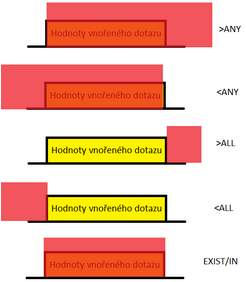

## Databáze
- Databáze - uspořádaná množina dat ve formě záznamů a vztahů
- SŘBD (Systém řízení báze dat) - pro přístup k a údržbě databáze (Oracle, MS Acces, MySQL)
- Databázový systém - Databáze (Data) + SŘBD (Systém)

#### Integritní omezení
- Entitní - žádné dva záznamy nesmí být stejné
    - Slabá entita - FK součástí PK, nemá smyslu bez druhé entity
    - Silná entita - Může existovat nezávisle na jiných entitách
- Doménové - Každý atribut musí mít právě 1 datový typ
- Referenční - Nelze vyplnit cizí klíč bez primárního klíče entity nadřazené
- Uživatelské - Ověřovací pravidla (Věk nesmí být záporný atd.)
#### Modely
- Konceptuální - nezávislý na konkrétní technologii
    - Entity, vztahy, atributy
        - Entita - objekt reálného světa (záznam v tabulce)
        - Atribut - vlastnost entity (slouec v tabulce)
        - Entitní typ - množina entit (tabulka)
        - Klíč - jeden, nebo více atributů, jednoznačně identifikující entitu
        - Vztahy
            - Kardinalita
            - Povinost
- Databázový - závislý na technologii, ale ne na konkrétním jazyce
    - Přibývá FK, rozepisuje se M:N, dataové typy
- Fyzický - reprezentuje fyzické uložení dat
---
#### Formy
- 0NF - Alespoń jeden atribut má více hodnot
- 1NF - Každý atribut obsahuje atomické hodnoty
- 2NF - Každý neklíčový atribut je plně závislý na celém PK
- 3NF - Všechny neklíčové atributy musí být vzájemně nezávislé
- Boyceho-Coddova NF - Atributy primárního klíče jsou vzájemně nezávislé
#### Funkční závislosti
- Vztah mezi atributy v db
- X -> Y (Y je funkčne závislé na X)
    - Pokud je více záznamů, které obsahují sterjné X, musí mít stejné Y
- Uzávěr X - množina atributů, závislá na množině atributů X
- Armstrongovy axiomy
    - Pravidla k odvozování funkčních závislostí
        - Reflexivita
            - Pokud je množina podmnožnou jiné, je závislá
            - množina {jméno} je podmnožinou {jméno, příjmení}, takže {jméno, příjmení} -> jméno
        - Tranzitivita - zřetěžení závilostí
            - X -> Y a Y -> Z => X -> Z
        - Pseudotranzitivita
            - X -> Y a WY -> Z => WX -> Z
        - Sjednocení
            - X -> Y a X -> Z => X -> YZ
        - Dekompozice
            - X -> YZ => X -> Y a X -> Z
        - Augmentace (Rozšíření)
            - X -> Y => XZ -> YZ
        - Zúžení
            - X -> Y a Z je podmnožinou Y => X -> Z

#### ORMD
Objektově relační datový model. Využívají ho například PostgreSQL, Oracle Database
- Rozšiřuje RM o vlastnosti objektů (komplexní datové typy, zapouzdření, dědičnost, metody, transakce)
    - UDT (user data type) - možnost vytvářet vlastní datové typy
    ```
    CREATE TYPE adresa AS (
        ulice TEXT,
        mesto TEXT
    );
    ```
    - Vnořené struktury
    ```
    CREATE TABLE zakaznik (
        id INT,
        adresa adresa
    );
    ```
    - Dědičnost
    ```
    CREATE TABLE zamestnanec (
        plat INT
    ) INHERITS (osoba);
    ```
- \+ Lepší mapování, méně joinů, lepší práce se složitými daty
- \- Složitý návrh, nižší výkon, horší přenositelnost
## SQL my beloved
- SQL (Strucutred Query Language), relační jazyk založen na predikátovém kalkulu
    - DDL (Data definition language) - Definuje strukturu dat
        - Create, Drop, Alter, Truncate, Rename
        - Omezení - Not Null, Unique, Primary key, Foreign key, Index, Check, Auto_Incement, Default
    - DML (Data manipulation language) - Manipuluje s daty
        - Insert, Update, Delete, Lock, Call
    - DQL (Data query language) - Vrací data z db
        - Select, From, Where, Group By, Having, Distinct, Order By,  Limit (MySql, MariaDB)...
            - Oracle Fetch next 5 rows only, JetSQL Select top 5
    - DCL (Data control language) - Práva a permise
        - Grant, Revoke
    - TCL (Transaction control language) - Transakce
        - Begin Transaction, Commit, Rollback, Savepoint
---
- TRUNCATE je DDL (smaže tabulku a vytvoří novou, nespustí ON DELETE trigger, autocommit...)
- DELETE FROM je DML (projde řádek po řádku a smaže záznamy)
#### DQL
- Select - povinný
- From - nepovný(MySql, PostgreSQL, MariaDB) | povinný(Oracle "From DUAL") (JetSQL docs říká poviný, není potřeba)
- Zbytek nepovinný (Vyjímkou je Having, který požaduje Group by)
- **Joins** (Left join == left outer join), outer je navíc, zbytečné, nepodstatné...
    - Left join - Všechno zleva + to co je zprava
    - Right join - Všechno zprava + to co je zleva
    - Inner join - To co mají společné
    - Full join - Všechno
    - Cross join - Kartézský součin (Pro každý záznam spojí s každým z druhé)
- Aliasy jsou finální - ``SELECT * FROM table as t...``
    - ``...WHERE t.atribut`` - projde
    - ``...WHERE table.atribut`` - fail (table už v rámci tohoto SELECtu neexistuje, je to pouze t)
- Selekce (Restrikce) - které řádky chceme (Where)
- Projekce - které sloupce chceme (SELECT sloupec1, sloupec2...)
#### Agregační funkce
- Můžou být použité v select a having
- Vrací jednu hodnotu z více hodnot ve sloupci
    - MIN - čísla, měny, data, znaky
    - MAX - čísla, měny, data, znaky
    - SUM - pouze číselné hodnoty
    - COUNT - všechny hodnoty
    - AVG - pouze číselné hodnoty
#### Množinové operace
- IN - Vrací hodnoty, funguje jako více OR
    - Lepší pro malé seznamy
- EXISTS - Vrací řádky
    - Rychlejší než IN pro větší počty hodnot, pomalejší pro menší množství hodnot
- ALL
- ANY/SOME



## Proceduální rozšíření (PL/SQL, T/SQL...)

- \+ Přidává proceduální logiku, tím umožńuje dělat některé operace na serveru a snížit potřebnou komunikaci s klientem. Umožňuje nezávislot na platformě klienta
- \- Neexistuje přesná specifikace

#### Procedury
- **Anonymní procedury** - Nejsou pojmenované, nemohou být volané v jiné proceduře. Nejsou předkompilované
```
BEGIN
 //...
EXCEPTION
    when other then
    //...
END;
```
- **Pojmenované procedury** - Obsahují hlavičku => jméno a parametry. Může být volána v jiné proceduře, triggeru, nebo příkazem EXECUTE. Předkompilované a uložené v DB (na rozdíl od funkce nevrací hodnotu)
```
CREATE OR REPLACE PROCEDURE Nazev (atribut1 student.login%TYPE) as
BEGIN
//...
EXCEPTION
//...
END;
```
- **Funkce** - Jako pojmenované procedury, ale vrací hodnotu
```
CREATE OR REPLACE FUNCTION Nazev (atribut1 student.login%TYPE) return VARCHAR2 as
BEGIN
//...
EXCEPTION
//...
END;
```
#### Triggery
Spouští se automaticky na základě DML operace (Insert, update, delete). Specifikuje se na jakou akci reaguje, zda se má spustit před, po, nebo místo akce. Referncuje staré hodnoty jako :OLD a nové :NEW (:OLD.login | :NEW.login)
```
CREATE OR REPLACE TRIGGER Nazev
BEFORE DELETE ON tabulka1 // AFTER INSERT, INSTEAD OF UPDATE....
FOR EACH ROW //Row-level trigger. Není povinné, hodnoty :OLD, :NEW fungují jenom s tímhle.
BEGIN
//...
END
```
#### Kurzory
Ukazatel na řádek
- Implicitní - Databáze ho vytváří automaticky pro vnitřní funkčnost(napr. při SELECT INTO, INSERT, UPDATE...)
    - Pracuje s jedním příkazem
    - Atributy: SQL%ROWCOUNT, SQL%FOUND, SQL%NOTFOUND
- Explicitní - Definuje uživatel
    - Umožňuje použití OPEN, FETCH, CLOSE
    - Umožňuje pracovat s více příkazy
Práce s kurzory:
    - 
