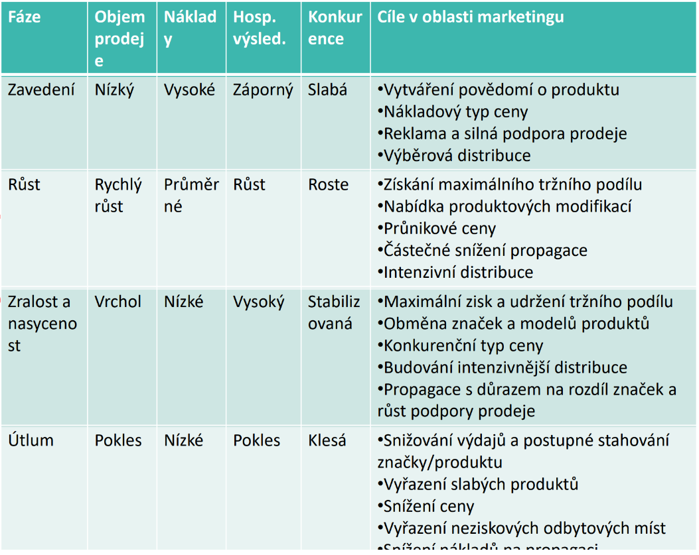

## PRVNÍ ČÁST
#### Fasovo moudro
- **Nedělejme něco proto, aby to bylo, ale proto, aby z toho něco bylo!**
#### Podnikatelský trojúhelník firmy
- Náklady
- Riziko
- Zisk
#### Životní cyklus prodejce
- Představit
- Přesvěčit
- Prodat 
- Doporučit
- Prodat
#### Určení ceny
- 1ks x 1.000.000,-
- 1.000ks x 1.000,-
- 10.000ks x 100,-
- ...
#### Stakeholder
- Interní
    - Zaměstnanci
    - Management
    - Jejich rodiny
    - Vlastníci
- Externí
    - Zákazníci
    - Dodavatelé
    - Konkurence
    - Média
#### Zákazníci
- Proaktivní
- Aktivní
- Reaktivní
- Neaktivní
- Negativní
- Destruktivní
#### Účetní rozvaha
- Aktiva
    - Dlouhodobý majetek
        - Nehmotný dlouhodobý majetek
        - Hmotný dlouhodobý majetek
        - Finanční dlouhodobý majetek
    - Oběžný majetek
        - Zásoby
        - Pohledávky
        - Krátkodobý finanční majetek
- Pasiva
    - Vlastní kapitál
        - Základní kapitál
    - Cizí zdroje
        - Závazky
        - Bankovní úvěry
        - Půjčky

#### Forma podnikání
- Podnikání fyzické osoby
    - OSVČ (Osoba samostatně výdělečně činná)
        - Řemeslná
        - Vázaná
        - Volná
    - Koncesované živnosti
- Podnikání právnické osoby
    - Osobní společnosti
        - Veřejná obchodní společnost (v. o. s.)
        - Komanditní společnost (k. s.)
    - Kapitálové společnosti
        - Společnost s ručením omezeným (s. r. o.)
        - Akciová společnost (a.s.)
    - Družstva

#### Elektronické podnikání
- Elektronické obchodování - využívání komunikačních technologií v procesech prodeje, nákupu...
- E-podnikání - integrace procesů aplikací a systému. 

- **B2B** - Business to business
- **B2C** - Business to customer
- **G2G** - Goverment to goverment
- **...**
#### Výhody internetu pro firmy
- Globálnost
    - Info z celého světa
    - 24/7 dostupnost
- Pernamentnost
    - Snadná aktualizace
- Mnohostranost
    - Texty, obrazy, zvuky...
- Efektivnost
    - Rychlost a spolehlivost e-komunikace
#### Nevýhody internetu pro firmy
- Problém internetu
    - Přetíženost
    - Bezpečnost
    - Spam
- Rizika s pohledu zákazníka
    - Peněžní prostředky
    - Vlastní pc
    - Nedostatek vědomostí/zkušeností
    - Pro některé slložitější úhrada
- Rizika s pohledu firmy
    - Nutnost osvojení technologií
    - Riziko úniku informací

#### Doména
- **Lehce zapamatovatelná**
- **Kvalitní hosting**
#### Termíny
- Podnik - soubor hmotných osobních a nehmotných složek podnikání
- Obchodní majetek - věci, pohledávky a jiné hodnoty, sloužící k podnikání (Obchodní majetek právnické osoby je veškerý její majetek)
- Neoprávněné podnikání - uskutečnění činosti, jež vyžaduje ohlášení nebo povolení, bez daného ohlášení nebo povolení
- Místo podnikání - adresa zapsaná v obchodním rejstříku nebo jiné evidenci
- Obchodní firma - název, pod kterým je podnikatel zapsán v obchodním rejstříku. Firmou fyzické osoby musí být vždy její jméno a příjmení
#### Certifikace APEK
- **Asociace pro elektronickou komerci**
    - Analýzy a studie
    - Tvorba a podpora etických principů
    - Workshopy, semináře
- Oblasti certifikace
    - Úplné a pravdivé informování o provozovateli
    - Úplné a pravdivé informování o zboží, cenách
    - Nákupní řád
    - Reklamační řád
    - Splňuje zákonné požadavky, zejména směrnice Evrpského parlamentu a Rady
#### Významné předpisy
- GDPR (General Data Protection Regulation)
- Ochrana osobních údajů
- Autorské poplatky - Autorské odměny se musí uvádět zvlášť na faktuře
- Recyklační poplatek
#### Eshop vs Aukce
- Různý obchodní model
- Odlišná struktura databáze
- Aukce větší nároky na ověření a důvěryhodnosti účastníků
#### Druhy Internetové reklamy
- Emailová
    - Firemní zpravodaj
- Grafická
    - Banery
        - Full banner
        - Skyscraper
        - Leader board
    - Flash
- Textová
    - Nekontextová
    - Kontextová
- Ostatní
    - Virální marketing
#### Zkratky
- SWOT (Strengths, Weaknesses, Opportunities, Threats)
- MVP (Minimum Viable Product) - Verze nového produktu, schopna uspokojit zákazníky 
- ROI (Return of Invesment) - (Zisk - Náklady) / Náklady * 100%
- STDC (See, Think, Do, Care)
    - See - zákazníci, kteří si prohlíží produkt
    - Think - zákazníci, kteří přemýšlí o koupi
    - Do - zákaznící, kteří koupí produkt
    - Care - stálí zákazníci
- SEM (Search Engine Marketing)
    - SEO (Search Engine Optimalization) - Cíl získat vyšší pozice při vyhledávání 
    - PPC (Pay-Per-Click) - Platba za proklik
---
## DRUHÁ ČÁST

#### Finanční plán
- soubor doporučení
#### Typ investorů
- Nonplaners - nic netuší *//me right now*
- Simple planners - mají představu, ale ne plán
- Serious planners - mají představu a plán, ale nedodržují
- Successful planners - úspěšně dodrželi plán
#### Etapy finančního plánu
- Akumulace
- Konsolidace
- Fáze spotřebování
- Fáze darů
#### Finanční analýza
- Rentabilita - informace o kapitálu a schopnosti tvořit zisk
- Likvidita - schopnost splácet včas
- Aktivita - intezita využití složek majetku
- Zadluženost - dlouhodobá stabiltia firmy
- Bod zvratu - minimální množství produkce, aby firma nebyla ve ztrátě
#### Úhrada zboží
- Platba předem
    - Na účet
    - Předfaktura
    - Proforma
    - Zálohová faktura
- Platba při dodání
    - Hotovost
    - Dobírka
- Následná platba
    - Faktura s datem splatnosti
#### Platba z pohledu kupujících
- Okamžité vypořádání
    - Hotově
    - Kartou
    - Bankovní převod
    - ...
- Splátky
    - Splátkový kalendář
    - Půjčka
    - Úvěr
    - Hypotéka
- Pronájem
    - Pravidelné splátky
    - Platba za užití
#### Platba z hlediska měny
- Lokální měna
- FIAT měna, USD, EUR...
- Kryptoměna
#### Platební brány
- ComGate
- GoPay
- Pays.cz
- PayU
- Stripe
- Gloal payments
- ...
- Confirmo (krypto platební brána)
#### Stanovení prodejní ceny
- Pořizovací cena / Výrobní náklady
- Marže předpokládaného zisku
- Recyklační poplatky
- Autorské poplatky
- DPH
- Koncová cena
#### Dodatečné navýšení ceny
- Manipulačni poplatek
- Balné
- Poštovné
- Doprava
- Neziskové navýšení ceny
#### Poštovné
- Obvykle s 21% DPH (vyjímka česká pošta)
- *Jsou li náklady na poštovné 100,- Kč, musím požadovat 121,- Kč, jinak mohu zaúčtovat pouze 83,30 Kč*
#### DPH
- Základní sazba - 21%
- Snížená sazba - 15%
    - Teplo, voda, potraviny
    - Ubytování, oprava zdravotního zařízení
    - Dovoz uměleckých děl, sběratelství
    - Budovy sociálního bydlení
- Osvobozená sazba - 0%
- **Placení**
    - Dobrovolný plátce
        - Vysoke vstupní investice
        - Solární elektrárna
    - Povinné placení
        - Obrat za předchozích 12 měsíců >= 1.000.000,- Kč
        - Příjmy ze zahraničí
        - Právní subjekt vytvořen na základě obchodního zákoníku
    - Výkazy DPH
        - Čtvrtleltní (do 10.000.000,- Kč)
        - Měsíční
        - Do 25. následujícího měsíce 
#### Zvláštní typy daní
- Spotřební
    - Daň z minerálních olejů
    - Z lihu, piva, vína
    - Tabák
- Ekologická
    - Zemní plyn
    - Tuhá paliva
    - Elektřina
#### Slevy
- Skonto - rychlé placení
- Bonus - větší odběr
- Bonifikace - zkrácení dodací lhůty
- Rabat - množstevní sleva
- Sleva
- Sleva za horší jakost
- Sleva jako výprodej
- 
- *Sleva nesmí generovat ztátu*
- *Nekontrolované slevy jsou kritické*
- *Sleva je nákupní pobídka*
- *Slevy je vhodné časově limitovat*
#### Věrnostní program
- Sleva na základě dlouhodobé spolupráce
- Sleva na základě obratu
- Příležitostné akce
#### Nekalá soutěž
- Klamvá reklama
- Klamavé označování zboží a služeb
- Vyvolávání nebezpečí záměny
- Parazitování na pověsti
- Podlpácení
- Zlehčování
- Srovnávácí reklama
- Porušení obchdního tajemství
- Ohrožování zdraví
#### Prodejní cyklus
- Nabídka
- Objednávka
- Proforma
- Faktura
- Doklad o úhradě
- Záruční list
    - Reklamace
- Dodací list
- Dobropis
- Vratka
---
## TŘETÍ ČÁST
#### Šest koncepcí marketingu 
1. **Výrobní orientace**
   - Maximální dostupnost, minimální cena
    - Poptávka převyšuje nabídku (přesycený trh)
1. **Výrobková orientace**
    - Produkty s vyšší kvalitou
    - Marketing zaměřený na zdokonalení 
1. **Prodejní orientace**
    - Nasycený trh
    - Intezivní distribuce, propagace... 
1. **Tržně marketingová orientace**
    - Přesně definovaný
1. **Společenský marketing**
    - Cíle firmy, požadavky zákazníků, zájmy společnosti
1. **Holistické orientace**
    - Vzájemné vztahy s klíčovými partnery
    - Interní marketing (Každý zaměstnanec)
    - Společenské, etické či ekologické zájmy
#### Marketingové prostředí
- Mikroprostředí
- Makroprostředí
    - Demografické - Lidé, jednotlivci
    - Společenské - Tradice, normy, postoje
    - Ekonomické - Inflace, ceny, úspory
    - Technologické
    - Přírodní - Klimatické podmínky, nerostné bohatství
    - Politické a právní - Zákony, legislativy
#### Zdroje informací
- Interní údaje firem
- Marketingové zpravodajství
- Marketingový výzkum
#### Získávání informací
- Primární informace
    - Pozorování
    - Experiment
    - Dotazování
- Sekundární informace
    - Interní zdroje
    - Externí zdroje
#### Typy dotazování
| Forma | Výhody | Nevýhody |
| --- | --- | --- |
| Osobní rozhovor | Přímý kontakt, množství informací | Vysoké náklady, vliv aktéra |
| Písemně | Nízke náklady, objektivnější odpovědi | Nízka návratovost, zdlouhavost, Riziko vlivu třetí strany |
| Telefonicky (fuj) | Rychlost, přímý kontakt | Není zachována anonymita | 
#### Segmentace trhu
- Spotřebitelského trhu
    - Geografická (Město, stát)
    - Demografická (Věk, pohlaví)
    - Socioekonomická (Vzdělání, příjem)
    - Psychografická (Zájmy, hodnoty)
    - Chování (očekáváný zisk, postoj k značce)
- Trhu firem
    - Demografická (Velikost firmy, odvětví)
    - Kritéria provozu (Technologie)
    - Nákupní přístupy (Organizace nákupu, vztahy)
    - Osobní charakteristiky (Věrnost, postoj k riziku)
#### Marketingový mix
- 4P-7P
    1. Product
    1. Price
    1. Place
    1. Promotion
    1. People
    1. Politics
    1. Public opinion 
- 4C
    1. Customer
    1. Cost
    1. Convinience
    1. Communications
- 4A
    1. Awarness
    1. Availability
    1. Affordability
    1. Acceptability
#### Tvorba produktu
- Jádro
- Vlastní produkt
    - Kvalita
    - Varianta produktu
    - Design
    - Obal
    - Značka
- Rozšířený produkt
- #### Životní cyklus produktu

#### Stanovení ceny
- Spodní hranice
- Horní hranice
- Cena konkurence
- Metodika stanovení ceny
#### Faktory ceny
- Firemní cíle
- Náklady
- Poptávky
- Konkurence
- Fáze životního cyklu produktu
- Právní a regulační opatření
#### Cenová politika
- Orientace na přežití
- Orientace na maximánlní zisk
- Orientace na největší podíl na trhu
- Všeobecný přístup
#### Příjmý prodej
- Na zakázku, se servisem
- Malému množství odběratelů
    - Vlastní prodejní prostory
    - Automaty
    - Bez prodejních prostor
    - Elektronický prodej
#### Nepříjmý prodej

---
## ČTVRTÁ ČÁST
#### Cloud služby
- Azure
- AWS (Amazon Web Service)
- Google cloud
- Digital ocean
#### Virtualizace
- Open stack
- vmWare
- XEN
#### Docker
- CoreOS
- Docker Engine
#### Operační systémy na bázi Linux
- Ubuntu
- Debian
- Cytrix
- Redhat
- TailOS
#### Web servery
- Apache
- nGinx
- Varnish
#### Verzovací systémy
- GitHub
- GitLab
- BitBucket
#### Skriptovací jazyky
- Perl
- Ruby
- PHP
- GO
- Python

#### Databáze <3
- PostgerSQL <3
- MySQL
- MariaDB
- Percona
- NonSQL
    - MongoDB
    - H-Base
    - Cassandra
#### Fulltext serach
- Lucene
- Elastic search
- Solr
#### Response desing
- Bootstrap
- ZURB Foundation
- Angular JS
- React JS
#### Mobilní aplikace
- Cordova
- Xamarin
- ~~Android studio~~ *//Pls no, save yourself*
