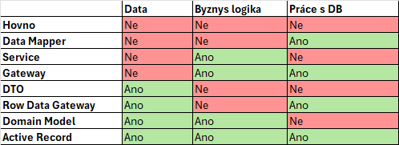

## VIS
## Vzory
 

#### Vzory pro práci s datovými zdroji
- **Table data gateway**
    - Gateway k tabulce, ne řádku. Poskytuje metody pro práci s celou tabulkou. Find, FindAll, Update, Delete...
- **Row data gateway**
    - Řádek z tabulky, bez logiky
- **Active record**
    - Řádek z tabulky, včetně logiky
- **Data mapper**
    - Konkrétní mapper, mapuje mezi DB a doménou
#### Vzory pro objektově-relační chování
- **Unit Of Work**
    - List změn, přidaných a odebraných objektů, poté provede všechny změny v rámci jedné transakce
- **Identity map**
    - Dictionary proti opakovanému načítáí stejného objektu
- **Lazy Load**
    - Data se načtou až ve chvíli, kdy jsou potřeba
#### Vzory pro databázové tabulky
- **Single table inheritance**
    - Jedna velká tabulka, obsahuje type sloupec a všechny bonusové atributy jako not null
- **Class table inheritance**
    - Jedna parrent tabulka a nové tabulky ji referencují pomocí foreign key
- **Concrete table ingeritance**
    - Každá tabulka má všechno potřebné, včetně redundantního základu
#### Vzory pro tabulkové vztahy
- **Association table mapping**
    - M:N vztah rozdělen na dvě 1:N a propojovací tabulku
- **Foreign key mapping**
    - 1:N vztah. Ukládá id z jedné tabulky jako foreign key v druhé, při načítání rovnou načte i druhou
#### Rest
- **Mapper**
    - Zajišťuje komunukaci mezi dvěma objekty. Obecný koncept
- **Dependent mapping**
    - Objekty, které namají samy smysl nemají vlastní mapper, ale využívají mapper nadřazeného objektu
- **Data transfer object**
    - Data bez logiky, přenáší data mezi vrstvami
- **Domain model**
    - Má vesškerá data (DTO) a veškerou logiku (Service), nemá však přístup k DB
- **Embeded value**
    - Objekt v objektu
- **Gateway**
    - Zapouzdřuje přístup k externímu zdroji
- **Serialized LOB**
    - Json, xml... Uloží jako jeden text/binárně. Jednoduché, ale musí se vždy načíst/uložit celý blok
- **Service layer**
    - Definuje sadu operací. Koordinuje doménovou logiku a transakce
- **Table model**
    - Logika práce s celou tabulkou. Používá DataTable nebo RecordSet (Table data gateway načte data a pošle do table model pro výpočet průměru...)
- **Transaction script**
    - Řeší kompletní use-case napříč více tabulkami v jedné transakci
- **Layer supertype**
    - Společný předek pro třídy ve vrstvě
- **Identity field**
    - Uloží id s DB jako id v DTO
- **Inheritance mappers**
    - Obecná struktura, která řeší mapování hiearchii v dědičnosti. Abstraktní mapper
## Architektura
#### Třívrstvá architektura
Linenární architektura: P -> B -> DA
- **Prezenční vrstva** - UI
- **Busyness vrstva** - Logika
- **Data acces vrstva** - DB
#### MVC
Obvykle neřeší přístup k datům
- **Model**
- **View**
- **Controller**
## Doména
Všechno v oboru
- Data, procesy, lidé, uživatelé, fyzické objekty...
#### Doménově specifický jazyk (DSL)
Programovací nebo deklarativní jazyk na konkrétní úzkou oblast
- **External**
    - Oddělený od hlavního kódu, má vlastní parser. SQL, HTML
- **Internal**
    - Využití syntaxe existujíícho jazyka. LINQ v C#