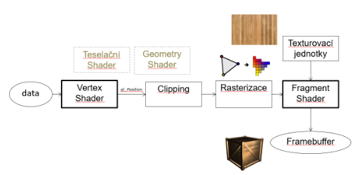
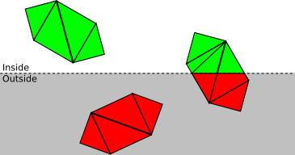
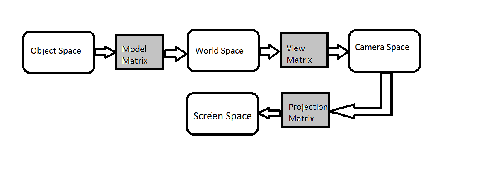
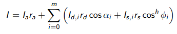
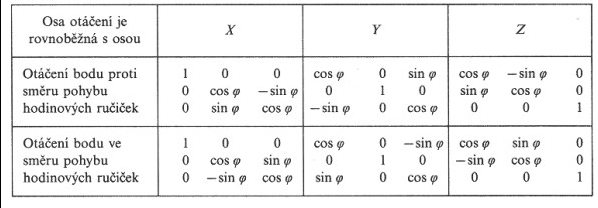

# ZPG
[1. Vykreslovaci pipeline](#1-vykreslovaci-pipeline)  
[2. Textury v Openggl typy-a-použití-v-pg](#2-textury-v-openggl-typy-a-použití-v-pg)  
[3. Identifikace zbufferstencil-unproject](#3-identifikace-zbufferstencil-unproject)  
[4. Promitani](#4-promitani)  
[5. Osvětlovací phongův systém definice-a-použití-v-pg](#5-osvětlovací-phongův-systém-definice-a-použití-v-pg)  
[6. Algoritmy viditelnostimaliruv-a-z-buffer](#6-algoritmy-viditelnostimaliruv-a-z-buffer)  
[7. Bezier definice-a-použití-v-pg](#7-bezier-definice-a-použití-v-pg)  
[8. Rotace 3D a 2D](#8-rotace-3d-a-2d-odvození-použití-v-pg)  
[9. Skybox použití-v-opengl](#9-skybox-použití-v-opengl)  
[10. Transformace pouziti-v-pg](#10-transformace-pouziti-v-pg)  
[11. Normálová matice](#11-normálová-maticeodvození-a-využití-v-pg)

# 1. Vykreslovaci pipeline

- **Vertex shader**
    - Určuje, kde budou body
    - Probíhají v něm transformace
- **Clipping**
    - Projde vrcholy, které se nezobrazí a odebere je. (Například jsou-li mimo pohledový prostor)

- **Rasterizace**
    - Převede tělsa na fragmenty
        - Fragment - *Kandidát* na pixel. Každá pozice pixelu může mít více fragmentů, při vykreslování se pak vykreslí ten nejbližší (většinou)
    - Pošle fragmenty do fragment shaderu
- **Fragment shader**
    - Interpoluje hloubku, barvu, texturu, normály...
- **Frame buffer** - Každý buffer má 8 bitů (0-255). Doublebuffer - Do jednoho se zapisuje, zatímco druhý je zobrazený, pak se přehodí. Zamezuje se tak postupnému vykreslování obrazovky. (Někde se používá triplebuffer -> same thing tbh)
    - Color buffer
        - Skládá se ze čtyř bufferů pro rgba (rgb ze tří)
        - Každý buffer určuje hodnotu jednotlivé barvy, popřípadě alfa složky
    - Depth buffer
        - Určue *hloubku* fragmentu. Jak blízko/daleko je od kamery
    - Stencil buffer
        - Udržuje o fragmentech číslo (stencil value), které pak může porovnávat s nějakým pravidlem
        - Na projektu u každého fragemntu udržuje id drawable objectu

# 2. Textury v OpengGL (typy a použití v PG)

- **UV**
    - UV mapa funguje jako graf nad obrázkem
    - x = u
    - y = v
    - Každý vertex má souřadnice (většinou <0-1>)
        - Při souřadnicích mimo <0-1> záleží na modelu dokreslování (opakování, zrdcadlení...)
    - Na polygon určený těmito body se pak vykreslí ta část obrázku, která odpovídá ploše danou uv souřadnicemi každého bodu
- **Texture unit**
    - Buffer na gpu, který obsahuje pixely, při vykreslování pak nemusí gpu tahat obrázky z cpu nebo disku
    - Pixel v textuře se nazývá **texel**
- **GL_TEXTURE_2D**
    - Standartní 2D obrázek.
    - Nahrává se na objekt
    - Používá souřadnice U,V
- **GL_TEXTURE_3D**
    - Jedná se o *kvádr* textury
    - Používá souřadnnice U,V,W
    - Popisuje co se děje uvnitř kvádru
    - Zpravidla pracuje s průhledností
    - Noise, kouř, dým...
- **GL_TEXTURE_CUBE_MAP**
    - Sampluje podle směrových vektorů, ne UV
    - Složený z šesti 2D textur +- x,y,z
    - Popisuje okolí definovaného kvádru
- **Mapy**
    - Určují jak se má povrch *chovat*
    - Roughness, metalic...

# 3. Identifikace (zbuffer+stencil), unproject

- **Zbuffer**
    - Každý fragment uchovává hloubku jak daleko je od kamery
    - Prochází fragmenty, uchovává ten nejbližší, najde-li bližší, zahodí ten přechozí a uloží si nový nejbližší
- **Project**
    - **Mproject * Mview * Mmodel * point**
    - Násobení matic zprava -> Model, View, Project = **MVP** 
    - `gl_Position = projectionMatrix * viewMatrix * modelMatrix * vec4(vertexPos, 1.0);`
- **Unproject**
    - Převádí objekt ze screen space do world space
    - **Mview-1 * Mproject-1 * clipPoint**

# 4. Promitani
- **Ortografické**
    - Zachovává poměry stran a úhly
    - Požívá se převážně v v CADech
- **Perspektivní**
    - Vytváří efekt hloubky
    - Prespektiva -> dál = menší

# 5. Osvětlovací phongův systém (definice a použití v PG)

- **I** - Intezita světla
- **r** - Materiálová složka
- **a** - Ambientní
    - Konstatní neměná složka, simuluje odraz paprsků, i když na plochu nesvítí žádné světlo, není žádoucí mít čistě černou plochu
    - Přidává se jedna na konec bez ohledu na počet světel
- **d** - Difuzní
    - Barevná část.
    - Alfa - Úhel mezi normálou povrchu a směrem ke světlu
- **s** - Spekulární
    - Odražená část (Odlesk)
    - Fí - Úhel mezi odraženým vektorem světla a směrem pohledu kamery (oka)
    - h - Shininess. Určuje jak moc se bude odlesk *rozlévat*
        - Větší číslo -> Strmnější pád funkce cosinus -> Menší plocha odlesku
- **HM - Blinn**
    - Fí - Úhel mezi half vecotrem (poloviční mezi vektorem světla a vektorem ke kameře/oku) a normálovým vektorem

# 6. Algoritmy viditelnosti(maliruv a z-buffer)
- **Malířův algoritmus**
    - Seřadí polygony dle vzdálenosti
    - Vykresluje od nejvzdálenějšího k nejbližšímu
    - Při konfliktu rozdělí polygon a jede znova
    - Může se zacyklit
- **Zbuffer**
    - Každý fragment uchovává depth Z
    - Prochází fragmenty, uchovává ten nejbližší, najde-li bližší, zahodí ten přechozí a uloží si nový nejbližší

# 7. Bezier (definice a použití v PG)
- Obecný vzorec
- $P(t) = \sum_{i=0}^{n} P_iB_i^n(t)$
- Suma všech bodů, násobených všemi bázovými funkcemi
    - Součet všech bázových funkcí pro libovolné t: 1

| **A+B vzorec** | **Bezier** |
| --- | --- |
| (a + b) = a + b | (1-t)P0 + tP1
| (a + b)2 = a2 + 2ab + b2 | (t-1)2P0 + 2t(1-t)P1 + t2P2
| (a + b)3 = a3 + 3a2b + 3ab2 + b3 | (1-t)3P0 + 3(1-t)2tP1 + 3(1-t)t2P2 + t3P3
- **t** - Pozice na křivce
- **P0,P1...** - Kontrolní body
- **a** ≈ (1-t)
- **b** ≈ t
- **\+** každý člen * kontrolní bod Px

### Fergusonova křivka
- **P(t) = F0(t)V0 + F1(t)V1 + F2(t)v0 + F3(t)V1**
    - F0(t) = 2t3 - 3t2 + 1
    - F1(t) = -2t3 + 3t2
    - F2(t) = t3 - 2t2 + t
    - F3(t) = t3 - t2

# 8. Rotace 3D a 2D (odvození, použití v PG)

- **HM**
    - cos(0) = 1
    - sin(0) = 0
    - posun o 0 stupňů musí vracet jednotkovou matici
    - cosiny na diagonále
    - -sin / +sin ovlivňuje směr rotace
- Rotace probíhá kolem středu world space
- Rotace tělesa kolem vlastního středu požaduje translaci tělesa do středu wordl space -> rotace -> přesun zpátky

# 9. Skybox (použití v OpenGL)
- **GL_TEXTURE_CUBE_MAP**
    - Sampluje podle směrových vektorů, ne UV
    - Složený z šesti 2D textur +- x,y,z
    - Popisuje okolí definovaného kvádru
- **Velká kostka**
    - Velký objekt není vhodný
    - Lze 'vyjít' ven
    - Zfar může být too far -> skybox nepůjde vidět
    - CPU může genertovat objekty, které stejně nepůjdou vidět (mezi skybox a zfar, je-li zfar větší)
- **Malá kostka**
    - Vykreslí se první
    - Poté se vymaže depth buffer
    - Jakýkoliv další objek se vykreslí 'před' skybox
    - Kopíruje translaci z kamery/oka, aby nešlo 'vyjít' ven

# 10. Transformace (pouziti v PG)
- **Transalce**
- **Rotace**
- **Scale**

# 11. Normálová matice(odvození a využití v PG)
- Některé tranformace upraví normálové vektory špatným způsobem
- N = (M-1)T
- N poté násobí normálový vektor
- **Inverze**
- M * M-1 = 1
- **Transpozice** - Prohození řádků a sloupců  
| a  b | --- | a  c |  
| c  d | --- | b  d |
# 12. Pohledová matice
- Up, down, right