# ZSU
## Explorativní analýza dat (data a jejich vlastnosti – numerické, kategoriální a jiné atributy, statistické vlastnosti dat, vztahy mezi atributy).
### Explorativní analýza dat (EDA)
- Cílem je získat vhled do struktury dat, porozumět významu
    - Vizualizace dat
    - Detekce odlehlých hodnot (outliers)
    - Hledání souvislostí
    - Využití relevantních atributů (čištění, transformace dat...)
### Data a jejich vlastnosti – numerické, kategoriální a jiné atributy
- Datová matice
    - Řádky - záznamy
    - Sloupce - vlastnosti
    - Obvykle obsahuje více durhů datových typů
- Numerické atributy
    - Čísla (celá, reálná, komplexní)
        - Celá čísla se v praxi berou jako kategoriální, nebo se převádí na reálná
        - Zajímá nás minimum, maximum, průměr, medián, kvartil..
            - Kvartily
                - 25% - Dolní / První
                - 50% - Druhý / Medián
                - 75% - Třetí / Horní
    - Dělení
        - Intervalové veličiny
        - Poměrové veličiny
- Kategorické hodnoty
    - Hodnoty předem definované množiny
    - Mezi hodnotami není definován žádný vztah, lze testovat rovnost/nerovnost
    - Zpracování na číselný vstup
        - Binarizace - Transofrmace na binární formu (Ano/Ne, například Věk > 18)
        - Ordinal encoding - Přiřazuje čísla kategoriím s přirozeným pořadím (Kategorie malé, střední velké)
        - One-hot encoding - Každá kategorie dostane binární sloupe (red, green, blue):

            | red | blue | green |
            |------|------|-------|
            | 1    | 0    | 0     |
            | 0    | 1    | 0     |
            | 0    | 0    | 1     |
        - Embedding - Reprezentace pomocí vektorů realných čísel
            - Deep learning, NLP, vector dbs
        - Algorithmic encoding - Kódovaní pomocí algoritmu
- Ordinální atributy
    - Kategorie s jasným pořadím (Například známky A,B,C,D,F)
    - Lze porovnávat (>,<,=), ale ne odečítat, sčítat...
- Grafová data
    - Uzly a hrany
    - Zobrazuje strukturu i topologii a strukturu informací
## Statistické vlastnosti dat
- Populace
    - Celkový soubor všech objektů nebo jedinců
- Vzorek
    - Podmnožina populace, která je vybrána pro analýzu
- Výběr by měl zastupovat všechny kategorie
- Rozptyl
    - Kvadratická odchylka od průměru
    
    - Směrodatná odchylka
    
- Pravděpodobnostní distribuce

- Důležité hodnoty
    - Průměr (mean)
    - Medián (median)
    - Modus (mode)
    - Interquartile range (Q1 - Q3)
    - Variace (Xmax - Xmin)
    - Očekávaná hodnota (E(X)) - Teoretický průměr náhodné veličiny
        - Očekávasná hodnota hodu kostkou: 3.5
## Vztahy mezi atributy
- Nezávislost
    - A nemá vliv na B
- Korelace
    - Pokud A klesá/stoupá B klesá/stoupá
- Kauzální vztah
    - Příčina a následek
    - A způsobuje změnu B (snížíš teplotu => platíš víc za topení)
- Nelineární vztah
    - Atributy spolu souvisí ale ne lineárně (Atributy výkon a věk => Peak kolem 20)
### Kovariance
- Míra vyjádření, jak moc se proměnné shodují
    - Kladná když se zvyšují/snižují společně
    - Záporna když se zvyšují/snižují opačně

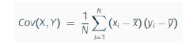
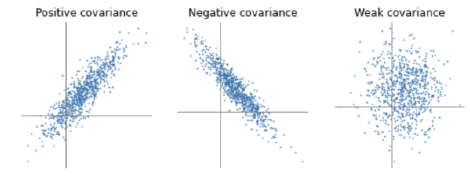

### Korelace
- Normalizovaná verzem která poskytuje sílu a směr lineárního vztahu
    - <-1 ; 1>
        - 1 - Dokonalá pozitivní
        - -1 - Dokonalá negativní
- **Pearsonův koeficient**

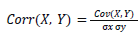
- σx, σy - Standartní odchylky
- Dělení kovariance standartními odchylkami obou hodnot získame hodnotu nezávislou na jednotkách

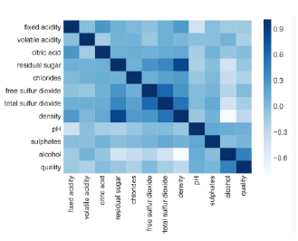

## Metody strojového učení (shlukování, klasifikace, vyhodnocení algoritmů)
- **Strojové učení je podmnožinou umělé inteligence**
- Schopnost "učit" počítač bez explicitiního naprogramování
    - Učení s učitelem (Supervised learning)
        - Určen výstup a trénovací data
        - Neuronky, rozhodovací stromy
    - Učení bez učitele (Unsupervised learning)
        - Výstup není stanovený
        - K-means shlukování
    - Učení s posilováním (Reinforcement learning)
        - Reward function
            - Agent je "odměněn/potrestán" podle výkonu
        - Autonomní řízení, hry
    - Kombinace (Semi-supervised learning)
        - Označené a neoznačené data
        - Zlepšování výkonu modelů
### Shlukování
- **Rozdělení objektů do shluků (clusterů) podle podobnosti.**
- Používá se u neoznačených dat
- **Metriky podobnosti**
    - Euklidovská vzdálenost
        - Rychlá, citlivá na outliery
        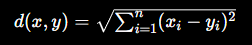
    - Manhattanská vzdálenost
        - Součet absolutních rozdílů
        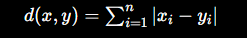
    - Kosinová podobnost
        - Cosinus úhlu mezi dvěma vektory
        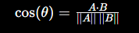

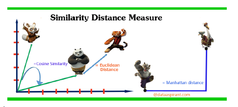

- **Algoritmy shlukování**
    - K-Means
        - K znamená počet clusterů
        - Vyberou se pseudonáhodné centroidy
        - Všechny instance se přiřadí nejbližsím centroidům
        - Centroidy jsou přesunuty ke středu shluků
    - Elbow method
        - SSE
            - Součet čtverců vzdáleností bodů od centroidu (menší = lepší)
        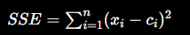
        - Hledáme loket by očko
    - Silhouette
        - Hdonocení kvality shluku
        - Jak moc je bod podobný svému shluku a jak moc se liší ostatním
        - Vnitřní podobnost
            - Průměr vzdálenost vůči všem bodům ve shluku
        - Vnější odlišnost
            - Průměr vzdálenosti vůči všem bodům nejbližšího shluku

        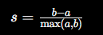
        - <-1 ; 1>
    - Hiearchické
        - Dendogram - Strom
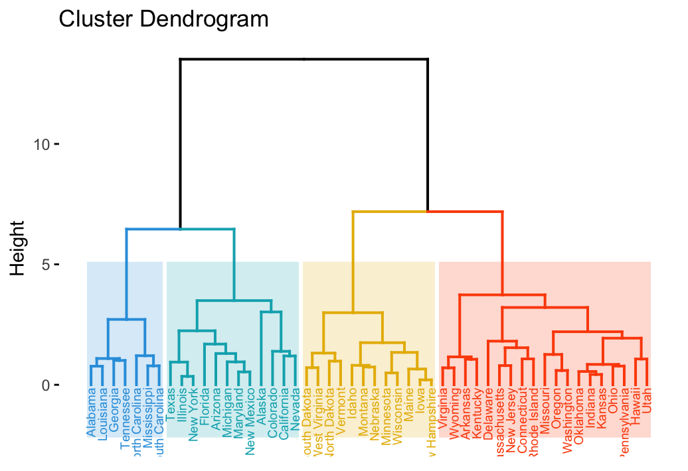
        - Aglomeratitvní (zdola nahoru)
            - Každý bod je samostatně
            - Postupně se spojují
        - Divizní (shora dolů)
            - Jeden shluk
            - Postupně se rozděluje
        - Vzdálenost mezi shluky
            - Single linkage
                - Nejbižší body
            - Complete linkage
                - Nejvzdálenější body
            - Average linkage
                - Průměrná vzdálenost
    - DBSCAN

- Validace
    - Interní
        - Hodnocení podle dat
            - SSE
                - Suma čtverců vzdáleností
            - SSQ
                - Suma čtverců vzdáleností od centroidu 
            - Cohesion (Soudružnost)
                - Průměrná vzdálenost bodů vuči centroidu
    - Externí
        - Porovnání s předem známými třídami

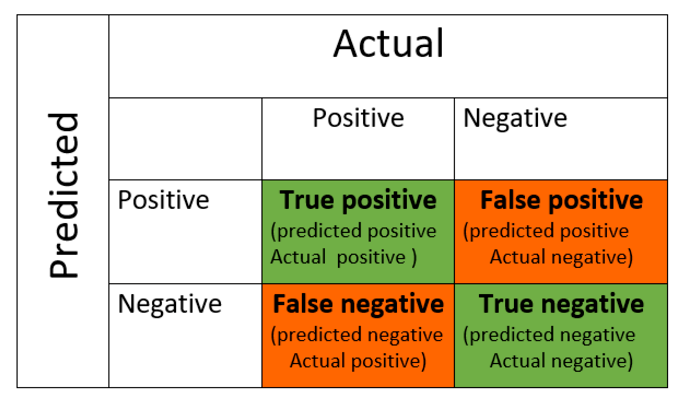

### Klasifikace
- **Přiřazení vstupu do předem známé kategorie**
- Trénink - obvykle 80%
    - Model dostane vstupy i správné odpovědi
    - Upravuje váhy a biasy
- Validace - obvykle 20%
    - Model trénuje na datech, které předtím neviděl
        - Ladění hyperparameters
        - Kontrola overfittingu
- Testování
    - Vyhodnocení přesnosti modelu
- K-nn
    - Vezme K nejbližších sousedů
    - Přiřadí ke třídě, nejvíce obsazené v k-nn
- 1R
    - Podle jednoho atributu
    
- Pravděpodobnostní
    - Podle pravděpodoností atributů
    - Naive Bayes
- Rozhodovací stromy
    - Sekvence if-else podmínek
    - Hledají se podmínky
    - Častý overfitting
- Neuronové sítě
    - Perceptron - jednoduchý neuron
        - Vstupy * váhy
        - Sečtení + bias
        - Aktivační funkce
        - Výstup
    - MLP (Multilayer Perceptron)
        - Více vrstev
            - Vstupní
            - Skryté
            - Výstupní
        - Backpropagation
            - Výpočet chyby
            - Zpětné šíření
            - Úprava vah

## Vyhodnocení algoritmů
- **Regrese**
    - Predikce číselné hodnoty
        - Lineární
            - jednoduché, mnohonásobné, ridge, lasso, elastic net
        - Nelineární
            -   Používá polynomy, exponenciály, logaritmy
- R2 - Jak dobře model vysvětluje data
- Chybové funkce
    - MAE - Mean absolute error
    - MSE - Mean squared error
    - MAPE - Mean absolute percentage error
- Accuracy
    - Celková přesnot
    - $\frac{TP+TN}{TP+TN+FP+FN}$
- Precision
    - Kolik pozitivních bylo správně
    - $\frac{TP}{TP+FP}$
- Recall
    - Úspěšnost nalezených pozitiv
    - $\frac{TP}{TP+FN}$
- F1 Score
    - Harmonický průměr Precision a Recall
    - $2 ⋅ \frac{Precision ⋅ Recall}{ Precision + Recall}$
- Gini index
    - Nečistota datového souboru
        - Pro 80% psi 20% kočky
            - $Gini=1−(0.8^2+0.2^2)=0.32$
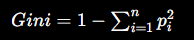
