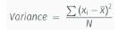
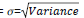
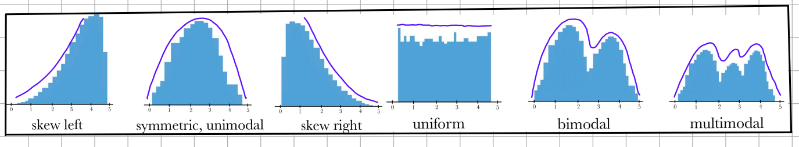

# ZSU
## Explorativní analýza dat (data a jejich vlastnosti – numerické, kategoriální a jiné atributy, statistické vlastnosti dat, vztahy mezi atributy).
### Explorativní analýza dat (EDA)
- Cílem je získat vhled do struktury dat, porozumět významu
    - Vizualizace dat
    - Detekce odlehlých hodnot (outliers)
    - Hledání souvislostí
    - Využití relevantních atributů (čištění, transformace dat...)
### Data a jejich vlastnosti – numerické, kategoriální a jiné atributy
- Datová matice
    - Řádky - záznamy
    - Sloupce - vlastnosti
    - Obvykle obsahuje více durhů datových typů
- Numerické atributy
    - Čísla (celá, reálná, komplexní)
        - Celá čísla se v praxi berou jako kategoriální, nebo se převádí na reálná
        - Zajímá nás minimum, maximum, průměr, medián, kvartil..
            - Kvartily
                - 25% - Dolní / První
                - 50% - Druhý / Medián
                - 75% - Třetí / Horní
    - Dělení
        - Intervalové veličiny
        - Poměrové veličiny
- Kategorické hodnoty
    - Hodnoty předem definované množiny
    - Mezi hodnotami není definován žádný vztah, lze testovat rovnost/nerovnost
    - Zpracování na číselný vstup
        - Binarizace - Transofrmace na binární formu (Ano/Ne, například Věk > 18)
        - Ordinal encoding - Přiřazuje čísla kategoriím s přirozeným pořadím (Kategorie malé, střední velké)
        - One-hot encoding - Každá kategorie dostane binární sloupe (red, green, blue):

            | red | blue | green |
            |------|------|-------|
            | 1    | 0    | 0     |
            | 0    | 1    | 0     |
            | 0    | 0    | 1     |
        - Embedding - Reprezentace pomocí vektorů realných čísel
            - Deep learning, NLP, vector dbs
        - Algorithmic encoding - Kódovaní pomocí algoritmu
- Ordinální atributy
    - Kategorie s jasným pořadím (Například známky A,B,C,D,F)
    - Lze porovnávat (>,<,=), ale ne odečítat, sčítat...
- Grafová data
    - Uzly a hrany
    - Zobrazuje strukturu i topologii a strukturu informací
## Statistické vlastnosti dat
- Populace
    - Celkový soubor všech objektů nebo jedinců
- Vzorek
    - Podmnožina populace, která je vybrána pro analýzu
- Výběr by měl zastupovat všechny kategorie
- Rozptyl
    - Kvadratická odchylka od průměru
    
    - Směrodatná odchylka
    
- Pravděpodobnostní distribuce

- Důležité hodnoty
    - Průměr (mean)
    - Medián (median)
    - Modus (mode)
    - Interquartile range (Q1 - Q3)
    - Variace (Xmax - Xmin)
    - Očekávaná hodnota (E(X)) - Teoretický průměr náhodné veličiny
        - Očekávasná hodnota hodu kostkou: 3.5
## Vztahy mezi atributy
- Nezávislost
    - A nemá vliv na B
- Korelace
    - Pokud A klesá/stoupá B klesá/stoupá
- Kauzální vztah
    - Příčina a následek
    - A způsobuje změnu B (snížíš teplotu => platíš víc za topení)
- Nelineární vztah
    - Atributy spolu souvisí ale ne lineárně (Atributy výkon a věk => Peak kolem 20)
### Kovariace
### Korelace